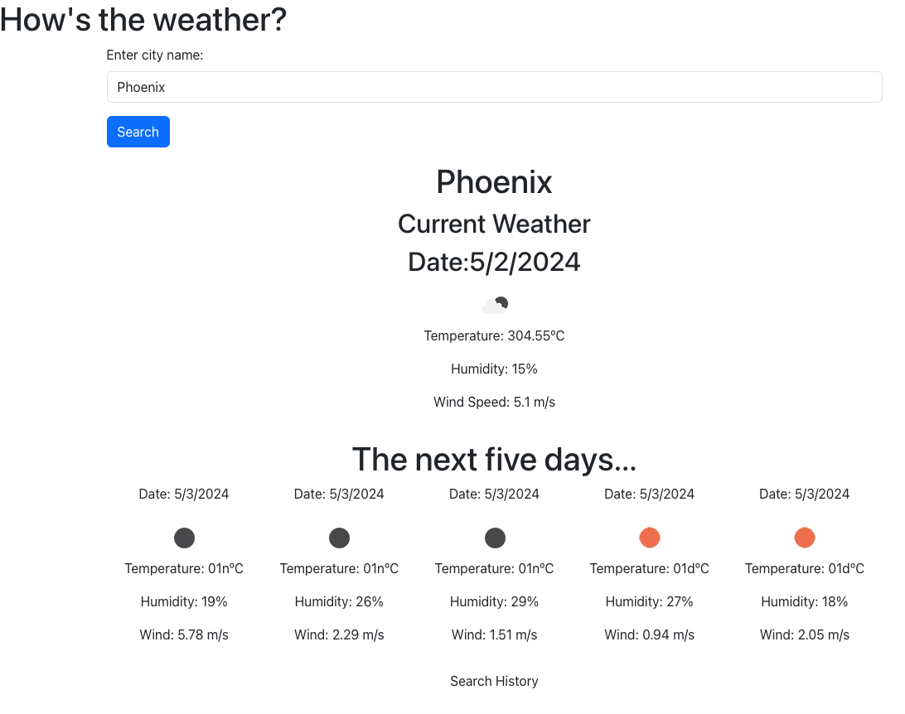

# weatherApp
Server Side API 

## Description
This app can be used to search for a city and get the current weather and 5 day forecast.

## Visuals

## Installation
no installation required.

## Usage
Search a city to get the current weather and five day forecast. 
This app will also save your history on the same machine. 

## Support
no support channels. 

## Roadmap
no further roadmap planned.

## Contributing
UCF coding Bootcamp 
Open Weather API

## Authors and acknowledgment
Thank you Open Weather and UCF Coding Bootcamp!

## License
UNLICENSED

## Project status
Development complete for the forseeable future. 
